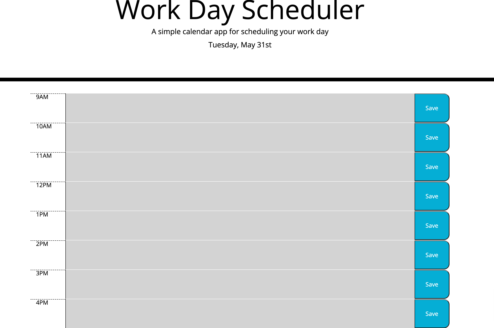

# Work Day Scheduler 

## Table of Contents 
1. [Description](#description)
2.  [Visuals](#visuals)
3. [Resources](#resources)

## Author:

Justin Stone

## Description

This webpage allows users to see a table containing the work day schedule, with different colors representing the current, future and past times. The user can then write notes into the schedule that will be saved in local storage. 

## Visuals

## Resources
[LIVE SITE](https://justinstone2001.github.io/Code-Quiz/)

[Repository](https://github.com/Justinstone2001/Code-Quiz)
